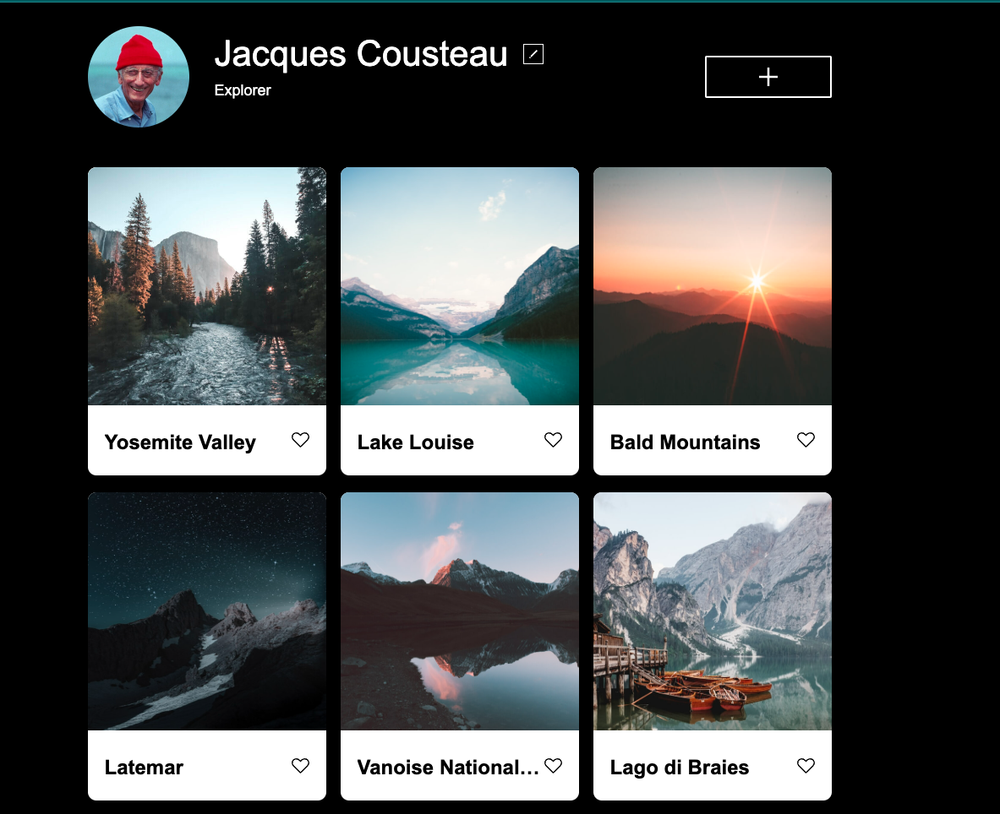

# Project 3: Around The U.S.

### Overview

- Intro
- Figma
- Images

**Intro**

This web app is made so all the elements are displayed correctly on popular screen sizes.
It allows the user to change the profile name and title.
This web app allows the user to upload an image of their choice as well as giving the image a title.

**Technologies use**
HTML
CSS
Media Queries
JavaScript
Figma
VS Code
Chrome Browser DevTools
Photo compression/Optimization

**Figma**

- [Link to the project on Figma](https://www.figma.com/file/ii4xxsJ0ghevUOcssTlHZv/Sprint-3%3A-Around-the-US?node-id=0%3A1)

**Images**

**Link to Website**
https://martdev1963.github.io/se_project_aroundtheus/
